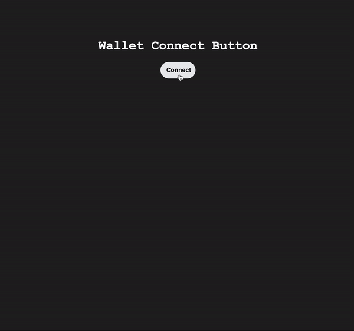
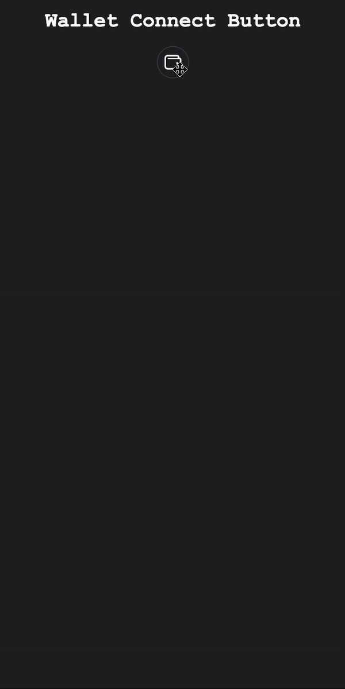

# @dewicats/connect-button

## Description

The `@dewicats/connect-button` package provides a simple and efficient way to integrate Solana wallet connectivity into Next.js applications. It offers components and hooks that facilitate connecting to Solana wallets like Phantom or Solflare and using MagicLink for email-based user authentication.

<div style="display: flex; justify-content: space-evenly;">
  
  
</div>

## Installation

You can install the package using either npm or Yarn:

```bash
npm i @dewicats/connect-button
# or
yarn add @dewicats/connect-button
```

## Usage

This package is designed to be used with Next.js and requires dynamic imports to function properly.

### Connect Button Provider

Wrap your application with the `ConnectButtonProvider` to set up the necessary context for the connect button and hooks.

```javascript
import dynamic from "next/dynamic";

const ConnectButtonProvider = dynamic(
  async () => (await import("@dewicats/connect-button")).ConnectButtonProvider,
  { ssr: false }
);

const ProviderWrapper = ({ children }) => {
  const rpcHost = process.env.NEXT_PUBLIC_REACT_APP_SOLANA_RPC_HOST ?? "";
  const magicKey = process.env.NEXT_PUBLIC_MAGIC_KEY;

  return (
    <ConnectButtonProvider magicKey={magicKey} solanaRpcHost={rpcHost}>
      {children}
    </ConnectButtonProvider>
  );
};
```

### Connect Button and useSolana Hook

- Use the `ConnectButton` component to render a button that allows users to connect their Solana wallet.
- The `useSolana` hook provides information about the wallet connection status.

```javascript
import dynamic from "next/dynamic";

const ConnectButton = dynamic(
  async () => await import("@dewicats/connect-button"),
  { ssr: false }
);

const useSolana = dynamic(
  async () => (await import("@dewicats/connect-button")).useSolana,
  { ssr: false }
);

export default function Home() {
  const { publicKey } = useSolana();

  return (
    <main>
      <h1>Wallet Connect Button</h1>
      <h2>publicAddress: {publicKey?.toBase58()}</h2>
      <ConnectButton compresedView />
    </main>
  );
}
```

## Attributes

### Connect Button

| Attribute          | Type           | Description                              |
| :----------------- | :--------      | :--------------------------------------- |
| `compresedView`    | `boolean`      | Turn on compresed view for small screens |
| `disableMagicLink` | `boolean`      | Disable Magic Link login option          |
| `logo`             | `JSX.Element`  | Change the logIn logo                    |

### Connect Button Provider

| Attribute       | Type     | Description                    |
| :-------------- | :------- | :----------------------------- |
| `solanaRpcHost` | `string` | Solana RPC host key            |
| `magicKey`      | `string` | Magic Link publishable API key |

### useSolana

| Attribute                   | Type                                                                | Description                                                                                       |
| :-------------------------- | :------------------------------------------------------------------ | :------------------------------------------------------------------------------------------------ |
| `publicKey`                 | `PublicKey` \| `undefined`                                          | Solana public key when connected.                                                                 |
| `connecting`                | `boolean`                                                           | Loading indicator when connecting.                                                                |
| `connected`                 | `boolean`                                                           | True when successfully connected.                                                                 |
| `magicAuthenticationStatus` | `MagicAuthenticationStatus`\*                                       | Current status of Magic Link connection.                                                          |
| `magic`                     | `InstanceWithExtensions<SDKBase, SolanaExtension[]>` \| `undefined` | Instance of Magic SDK with Solana extensions, or `undefined` if not available.                    |
| `wallet`                    | `Wallet` \| `null`                                                  | The current wallet instance or `null` if no wallet is connected.                                  |
| `disconnecting`             | `boolean`                                                           | Indicates whether the wallet is currently in the process of disconnecting.                        |
| `select`                    | Function                                                            | Function to select a specific wallet by name, or `null` to deselect.                              |
| `connect`                   | Function                                                            | Function to initiate a connection with specified wallet parameters.                               |
| `disconnect`                | Function                                                            | Function to disconnect the current wallet; returns a promise.                                     |
| `signAllTransactions`       | Function \| `undefined`                                             | Function to sign an array of transactions, or `undefined` if not available.                       |
| `signMessage`               | Function \| `undefined`                                             | Function to sign a message, or `undefined` if not available.                                      |
| `signIn`                    | Function \| `undefined`                                             | Function for signing in, optionally with specific input; returns a promise.                       |
| `sendTransaction`           | Function                                                            | Function to send a transaction through the provided connection with optional transaction options. |

\*MagicAuthenticationStatus = "unauthenticated" | "authenticated" | "pending" | "errored" | "invalid-code" | "authenticationCode";

## Features

- Easy integration with Next.js applications.
- Supports Solana wallets like Phantom and Solflare.
- MagicLink integration for email-based authentication.
- Provides both UI components and hooks for flexibility.

## Contributing

Contributions are welcome! To contribute, please create a branch and submit a pull request for review.

## License

This project is licensed under the MIT License.

## Support and Issues

For support or to report issues, please use the [GitHub Issues page](https://github.com/DeWiCats/connect-button/issues).

Made with ♥ by Dewicats
